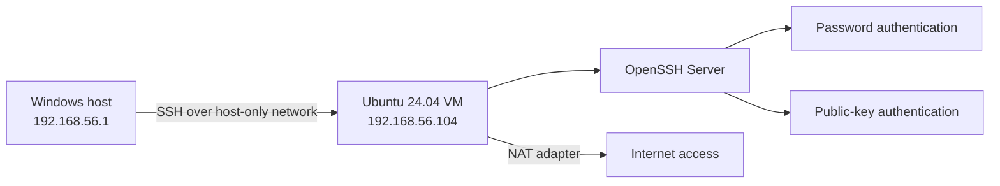
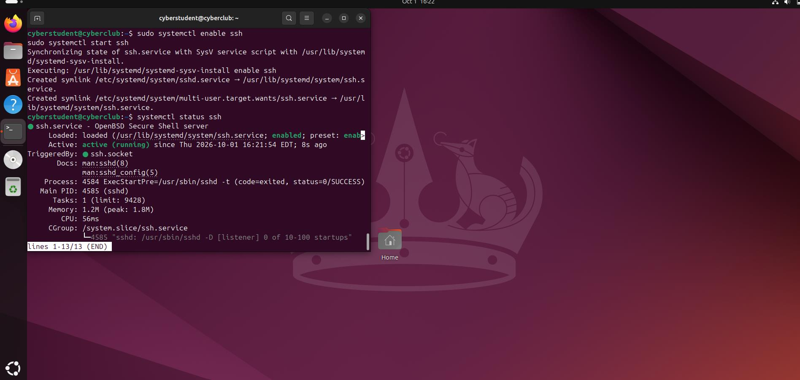
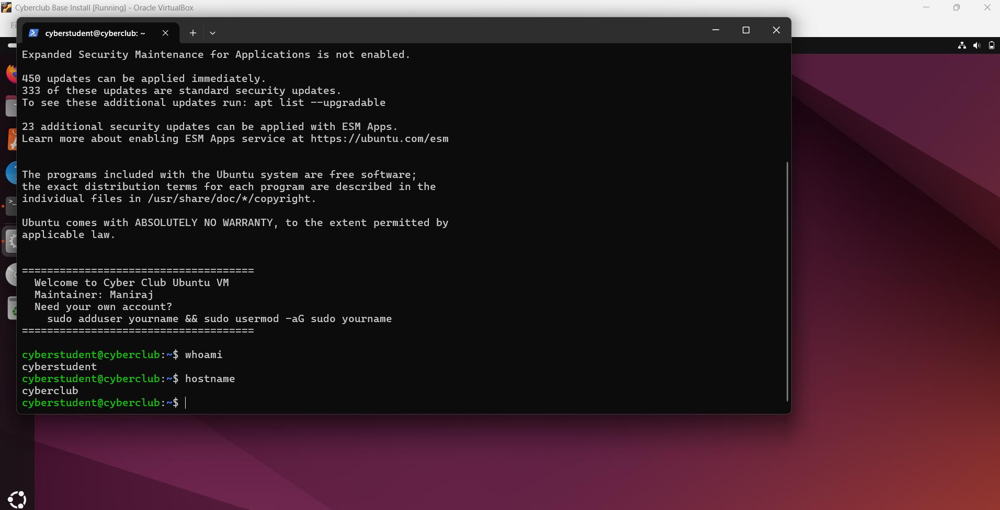
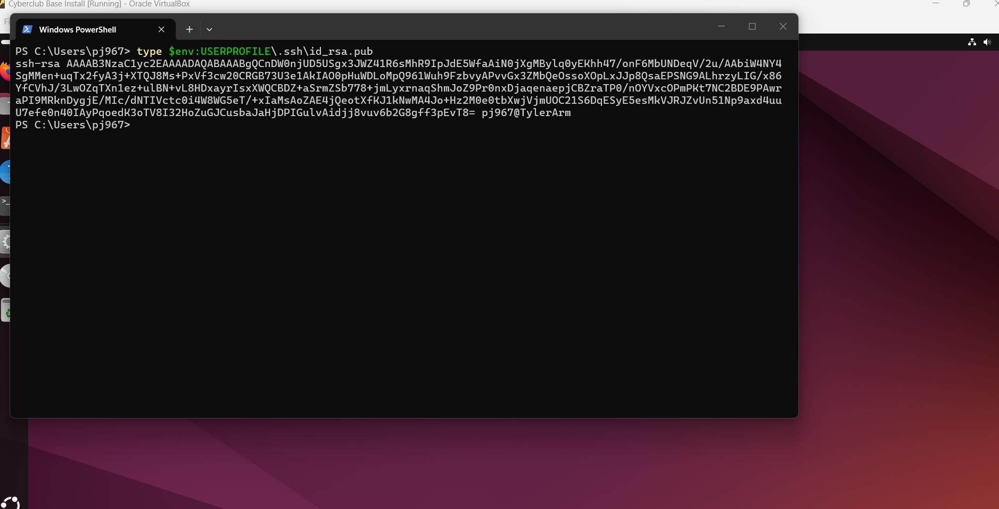
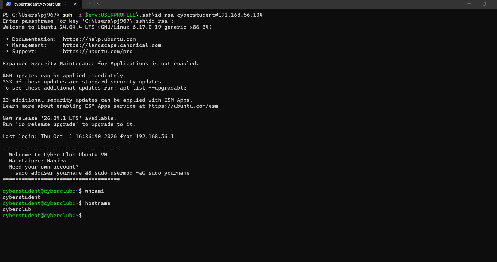
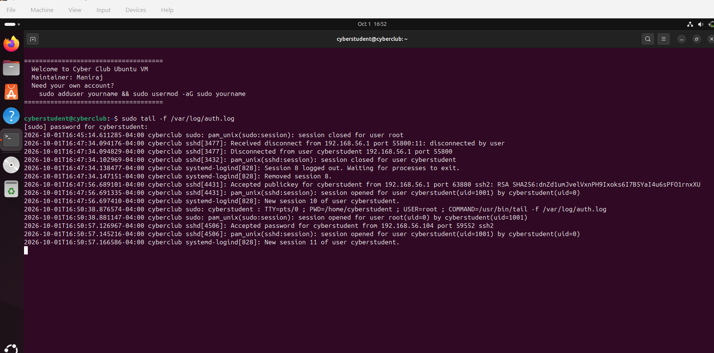
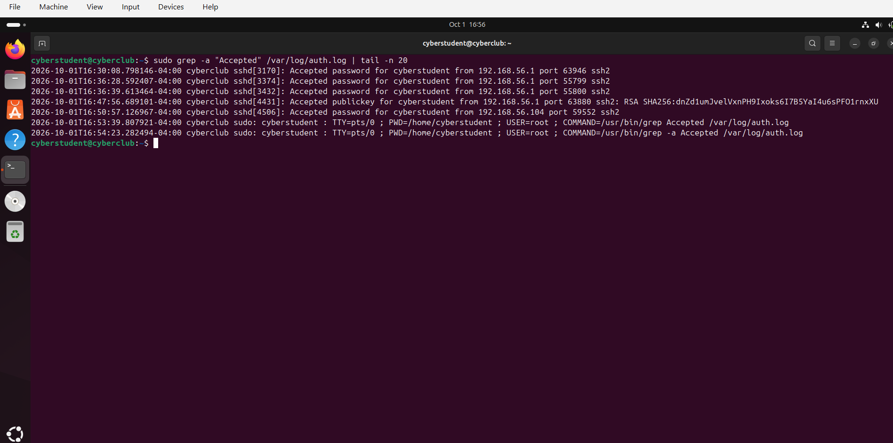

# SSH Public-Key Authentication Lab

Practical OpenSSH authentication lab demonstrating password-based and RSA public-key authentication between a Windows host and an Ubuntu 24.04 LTS virtual machine.

## Overview

I configured an OpenSSH server on Ubuntu, established host-to-guest connectivity in VirtualBox, and verified two SSH authentication methods from Windows PowerShell. After confirming a traditional password login, I generated a passphrase-protected RSA key pair, installed the public key in the Ubuntu account's `authorized_keys` file, applied the required permissions, and confirmed a successful key-based login in `/var/log/auth.log`.

The lab emphasizes the complete authentication workflow: service configuration, virtual networking, key management, Linux permissions, SSH client usage, and log-based verification.

## Objectives

- Install and enable OpenSSH Server on Ubuntu.
- Establish Windows-to-Ubuntu connectivity in VirtualBox.
- Verify password-based SSH authentication.
- Generate and protect an RSA key pair on the Windows client.
- Install the public key for the Ubuntu account.
- Apply the permissions required by OpenSSH.
- Verify public-key authentication through Linux logs.
- Compare password and public-key authentication events.

## Lab Environment

| Component | Configuration |
|---|---|
| Client | Windows host using PowerShell and the OpenSSH client |
| Server | Ubuntu 24.04 LTS virtual machine |
| Hypervisor | Oracle VirtualBox |
| Ubuntu user | `cyberstudent` |
| Ubuntu hostname | `cyberclub` |
| VM networking | Adapter 1: NAT; Adapter 2: Host-Only Adapter |
| Ubuntu host-only IP | `192.168.56.104` |
| Windows host-only IP | `192.168.56.1` |
| Authentication methods | Password and RSA public key |

## Network Architecture



The host-only adapter provided direct communication between Windows and Ubuntu. The NAT adapter remained enabled so the VM could still reach package repositories and other internet resources.

## Implementation

### 1. Install and enable OpenSSH Server

On Ubuntu, I installed the server package and configured the service to start automatically:

```bash
sudo apt-get install openssh-server
sudo systemctl enable ssh
sudo systemctl start ssh
systemctl status ssh
```

The service status confirmed that `ssh.service` was enabled and active.

### 2. Configure VirtualBox networking

The VM initially used the NAT address `10.0.2.15`, which was not directly reachable from the Windows host. I added a second VirtualBox adapter configured as **Host-Only Adapter**. Ubuntu then received `192.168.56.104`, while Windows used `192.168.56.1` on the same private network.

From Windows PowerShell, I verified connectivity:

```powershell
ping 192.168.56.104
```

### 3. Verify password authentication

I connected from Windows using the Ubuntu account credentials:

```powershell
ssh cyberstudent@192.168.56.104
```

After authentication, I confirmed the remote account and system:

```bash
whoami
hostname
```

The session returned `cyberstudent` and `cyberclub`.

### 4. Generate an RSA key pair

On Windows, I generated the key pair with:

```powershell
ssh-keygen -t rsa
```

The client created:

- `id_rsa` - private key retained on Windows
- `id_rsa.pub` - public key copied to Ubuntu

I protected the private key with a passphrase. The private-key contents are not included in this repository.

### 5. Copy the public key to Ubuntu

From Windows PowerShell, I transferred the public key with SCP:

```powershell
scp $env:USERPROFILE\.ssh\id_rsa.pub cyberstudent@192.168.56.104:/home/cyberstudent/
```

### 6. Configure `authorized_keys`

On Ubuntu, I created the SSH directory and installed the public key:

```bash
mkdir -p ~/.ssh
mv ~/id_rsa.pub ~/.ssh/authorized_keys
```

### 7. Apply secure permissions

OpenSSH can reject key authentication when the SSH directory or key file is too permissive. I applied the required ownership and modes:

```bash
chmod 700 ~/.ssh
chmod 600 ~/.ssh/authorized_keys
chown $USER:$USER ~/.ssh -R
```

The resulting permissions were:

```text
~/.ssh                 drwx------  (700)
~/.ssh/authorized_keys -rw-------  (600)
```

### 8. Configure and validate OpenSSH

I confirmed the following directive in `/etc/ssh/sshd_config`:

```text
AuthorizedKeysFile .ssh/authorized_keys
```

I then validated the configuration and restarted the SSH service:

```bash
sudo sshd -t
sudo service ssh restart
```

`sshd -t` returned no errors, indicating that the configuration syntax was valid.

### 9. Verify public-key authentication

From Windows PowerShell, I explicitly selected the private key:

```powershell
ssh -i $env:USERPROFILE\.ssh\id_rsa cyberstudent@192.168.56.104
```

The client requested the private-key passphrase rather than the Ubuntu account password. After the key was unlocked locally, the server accepted the matching public key and opened the SSH session.

### 10. Confirm authentication in Linux logs

I monitored the Ubuntu authentication log with:

```bash
sudo tail -f /var/log/auth.log
```

The successful key-based login produced an event similar to:

```text
Accepted publickey for cyberstudent from 192.168.56.1
```

To compare successful authentication methods, I used:

```bash
sudo grep -a "Accepted" /var/log/auth.log | tail -n 20
```

The filtered results contained both `Accepted password` and `Accepted publickey` entries.

## Verification Results

| Control or test | Evidence | Result |
|---|---|---|
| SSH service | `ssh.service` enabled and active | Passed |
| Network reachability | Ping to `192.168.56.104` with 0% loss | Passed |
| Password authentication | Interactive SSH session and `Accepted password` log | Passed |
| Key generation | RSA private/public key files created | Passed |
| Public-key installation | Key stored in `~/.ssh/authorized_keys` | Passed |
| File permissions | `.ssh` mode 700; `authorized_keys` mode 600 | Passed |
| SSH configuration | `sshd -t` completed without errors | Passed |
| Public-key authentication | SSH session and `Accepted publickey` log | Passed |

## Security Considerations

- The private key must remain on the client and should never be emailed, uploaded, or committed to Git.
- A passphrase protects the private key if the file is copied or the client device is compromised.
- The public key may be installed on a server, but it should still be managed and removed when access is no longer required.
- Restrictive ownership and permissions prevent unauthorized modification of `authorized_keys`.
- Server configuration should be syntax-checked before restarting SSH to reduce the risk of losing remote access.
- Modern environments often use Ed25519 keys; this lab used RSA to meet the assignment requirements and demonstrate the same public-key authentication model.
- Password authentication remained enabled for comparison during this lab. A hardened deployment could disable it only after key-based access and recovery procedures are verified.

## Troubleshooting

### Windows could not reach the NAT address

The Ubuntu VM initially received `10.0.2.15` through VirtualBox NAT. That address provided outbound connectivity but was not directly reachable from the Windows host. Adding a host-only adapter created a private network shared by the host and VM.

### Public-key authentication depends on permissions

If `~/.ssh` or `authorized_keys` is writable by unintended users, OpenSSH may ignore the key file. Modes 700 and 600, combined with correct ownership, resolved that requirement.

### `grep` reported that `auth.log` was a binary file

The initial command returned a binary-file warning. Adding `-a` forced text processing:

```bash
sudo grep -a "Accepted" /var/log/auth.log | tail -n 20
```

## Skills Demonstrated

- Linux and OpenSSH administration
- Windows PowerShell and SSH client usage
- VirtualBox NAT and host-only networking
- RSA key-pair generation and management
- Linux file ownership and permissions
- Secure authentication configuration
- SCP file transfer
- Service management with `systemctl`
- Configuration validation with `sshd -t`
- Authentication-log analysis

## Screenshots

### OpenSSH service running



### Host-only network connectivity


### Password-authenticated SSH session



### RSA public key



### Private-key protection


The screenshot demonstrates that the private-key file existed while intentionally excluding the complete key body.

### Public key copied to Ubuntu


### Public key installed in `authorized_keys`


### SSH file permissions


### OpenSSH configuration


### Successful public-key SSH session



### Public-key event in `auth.log`



### Password and public-key events



## Conclusion

The lab successfully demonstrated both password-based and public-key SSH authentication between a Windows client and an Ubuntu server. The final log evidence confirmed that OpenSSH accepted the RSA public key associated with the passphrase-protected private key on Windows. The exercise connected networking, Linux permissions, key management, service configuration, and log analysis into one verifiable authentication workflow.

## Responsible Use

This repository documents an authorized lab performed on systems and virtual networks under my control. Do not attempt to access SSH servers without explicit permission.
